# Análise de Sentenças

Este repositório contém a análise de sentimentos de três sentenças distintas. A estrutura segue a ordem:

- **Análise** (contendo as imagens das sentenças analisadas)
- **Resultado** (imagem do resultado final)
- **Análise dos Resultados** (interpretação dos sentimentos)

## Sentença 1
- **Análise:**
  - 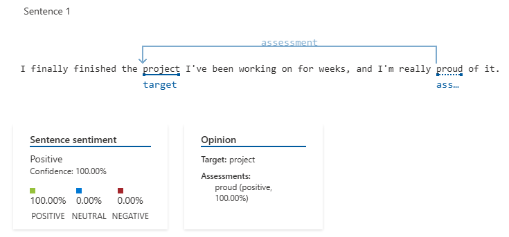
  - 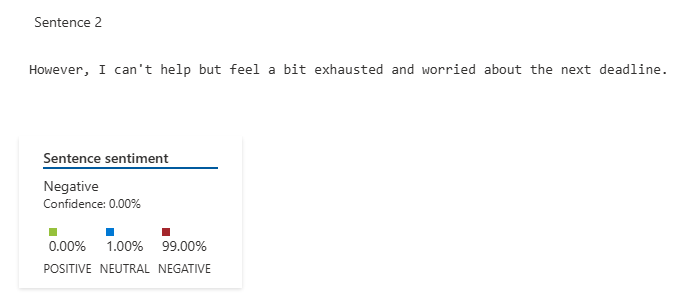
  - 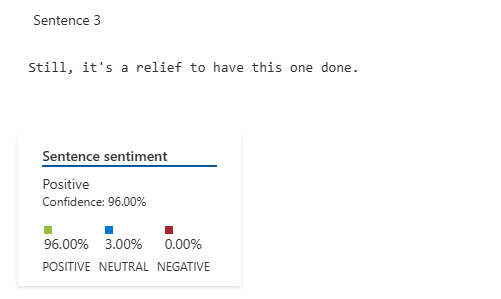
- **Resultado:**
  - 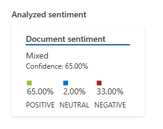
- **Análise dos Resultados:**
  O sentimento geral foi classificado como **misto**, com **65% de positividade**, **33% de negatividade** e **2% de neutralidade**.
  - A primeira frase expressa **positividade total (100%)**, porque descreve uma conquista com orgulho.
  - A segunda frase é **predominantemente negativa (99%)**, porque enfatiza cansaço e preocupação com prazos.
  - A terceira frase traz um tom **positivo (96%)**, mostrando alívio ao concluir a tarefa.
  - A oscilação entre **entusiasmo, exaustão e alívio** justifica a classificação geral como **misto**.

## Sentença 2
- **Análise:**
  - 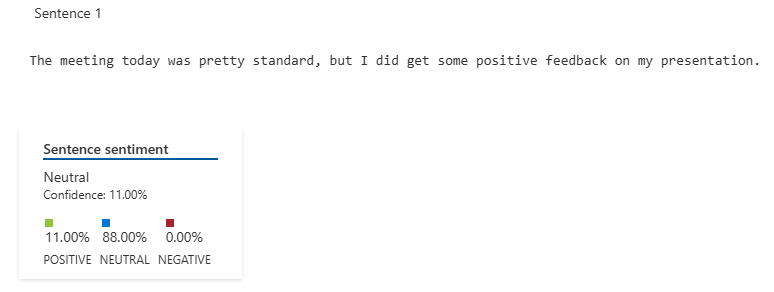
  - 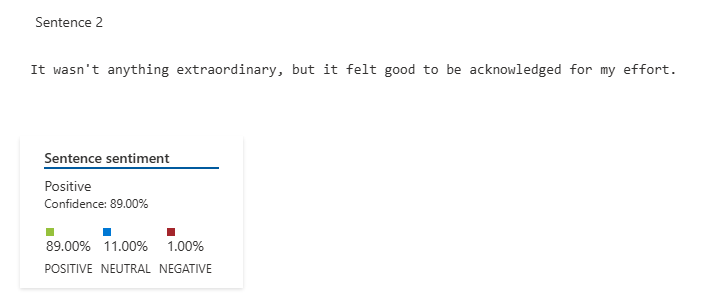
- **Resultado:**
  - 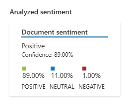
- **Análise dos Resultados:**
  O sentimento geral foi **positivo (89%)**, com uma leve presença de **neutralidade (11%)** e quase nenhuma **negatividade (1%)**.
  - A primeira frase foi avaliada como **neutra (88%)**, pois descreve uma reunião padrão, sem carga emocional forte.
  - A segunda frase foi **positiva (89%)**, porque expressa reconhecimento e satisfação pelo feedback recebido.
  - O resultado positivo reflete o impacto motivacional do reconhecimento, mesmo que o evento em si tenha sido normal.

## Sentença 3
- **Análise:**
  - 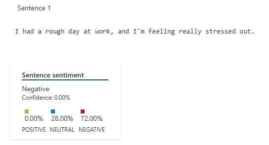
  - 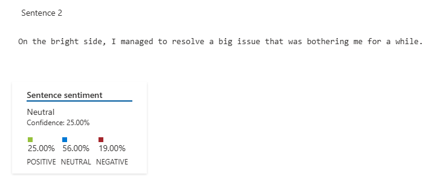
  - 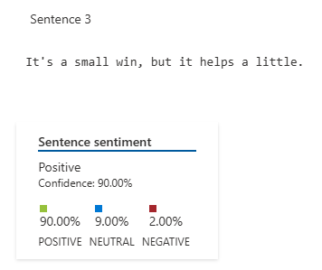
- **Resultado:**
  - 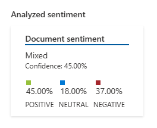
- **Análise dos Resultados:**
  O sentimento geral foi **misto**, com **45% de positividade**, **37% de negatividade** e **18% de neutralidade**.
  - A primeira frase foi considerada **negativa (72%)**, pois descreve um dia ruim e alto nível de estresse.
  - A segunda frase foi **neutra (56%)**, pois destaca um aspecto positivo (resolver um problema), mas sem forte impacto emocional.
  - A última frase foi **positiva (90%)**, pois reconhece uma pequena vitória, trazendo um tom de alívio.
  - A combinação de **frustração inicial, alívio parcial e um pequeno ganho positivo** justificam o sentimento misto.

  - 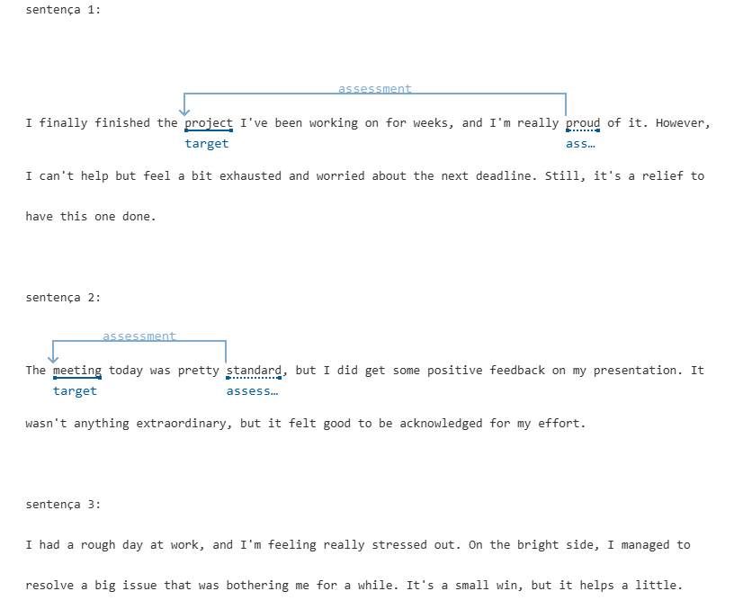
---

## Informações adicionais
Os arquivos `.json` dentro de cada pasta contêm o log detalhado dos resultados da análise, incluindo os níveis de confiança de cada classificação.
